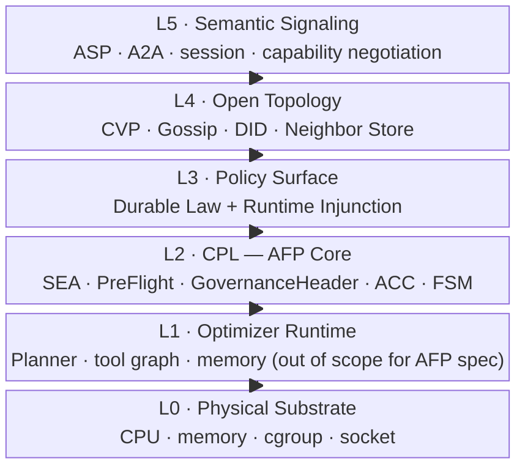
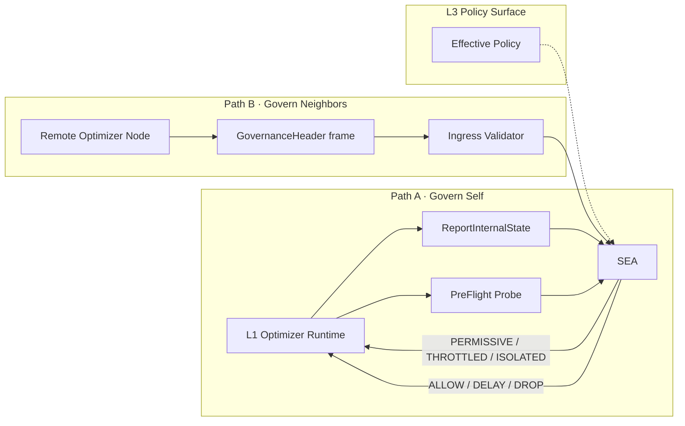
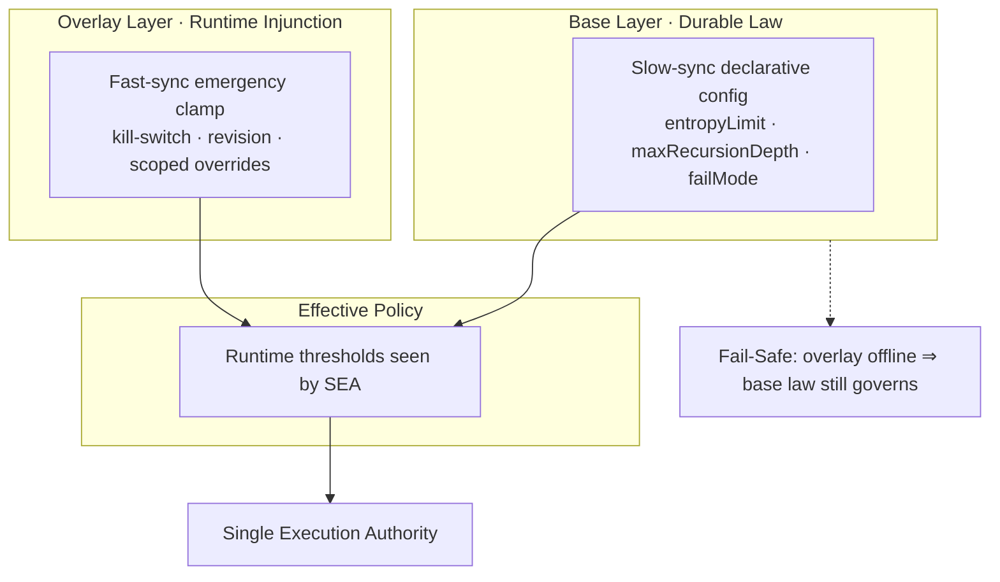
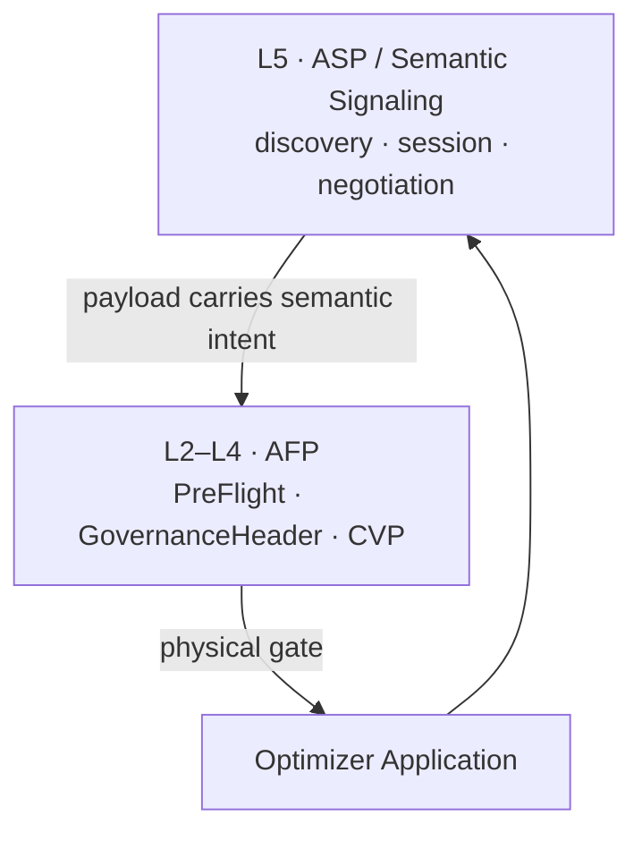

# AFP Protocol Architecture

> **Aegis Fabric Protocol (AFP)** — *A Physical Constraint Protocol for Autonomous Optimizers*
>
> Protocol Specification · Draft v1.0 · Reference Implementation: PR-6c

This document is the **technical contract** between:

| Document | Role |
|----------|------|
| **This file (`ARCHITECTURE.md`)** | Protocol stack, core objects, enforcement paths — **language-agnostic** |
| **Whitepaper v2.0 (Protocol Edition)** | Theory, proofs, open-network equilibrium — [`docs/whitepaper-v2/`](docs/whitepaper-v2/) |
| **Enterprise Deployment Guide** | K8s, GitOps, compliance — separate handbook (`README.md`, `deploy/kubernetes/`) |
| **`CODEBASE.md`** | Repository navigation and file paths |

**Design law:** *TCP governs packets. AFP governs optimizers.*

**Stack law:** *Argent Signaling Protocol (ASP) governs collaboration semantics (L5). AFP governs physical consequences (L2–L4). Complementary, not competitive.*

---

## 1. Six-Layer Protocol Stack

AFP uses an OSI-style layering model. Each layer has a single accountability boundary.



| Layer | Governs | AFP responsibility |
|-------|---------|-------------------|
| **L5** | Exposed intents, sessions | **Does not replace.** Defines sufficiency boundary vs ASP |
| **L4** | Trust under distrust | CVP evolution, topological quarantine, gossip |
| **L3** | Cluster-wide thresholds | Abstract policy surface (base + overlay, fail-safe) |
| **L2** | Physical consequences | **Core protocol:** pre-intent enforcement, persistence |
| **L1** | Internal optimization | Observed and constrained, not specified |
| **L0** | Hardware | Measurement substrate for entropy |

Classic Internet stacks govern **packets** and **messages**. AFP governs **optimization trajectories**—planning, recursion, delegation, context growth—most of which never produce wire-visible I/O.

---

## 2. Dual-Path Enforcement

All enforcement converges on a **Single Execution Authority (SEA)**. Two ingress paths prevent split-brain between local intent and peer traffic.



| Path | When | Interface | Layer |
|------|------|-----------|-------|
| **A · PreFlight** | Before local intent executes | Local IPC probe | L1 → L2 |
| **B · GovernanceHeader** | Before peer traffic is admitted | LV-framed wire attestation | L4 → L2 |

**Invariant:** Path A and Path B MUST share the same ACC kernel, FSM states, and effective policy snapshot. Local compute and network I/O are governed by one control law.

---

## 3. Policy Surface (L3)

L3 is specified abstractly. Implementations MAY use any durable store and fast overlay channel.



| Property | Base Layer | Overlay Layer |
|----------|------------|---------------|
| **Latency** | Slow (eventually consistent) | Fast (sub-second) |
| **Purpose** | Auditable durable law | Incident response, fleet clamp |
| **Survival** | MUST survive control-plane outage | MAY be unavailable |

---

## 4. Five Core Objects — Protocol Definitions

### 4.1 CPL — Consequence Persistence Layer

**Role:** The identity of AFP as a protocol layer—not a product module.

**Definition.** An out-of-band physical constraint surface attached to an optimizer execution boundary such that enforcement outcomes **persist across scheduling epochs** until policy or FSM state permits recovery.

**Required properties.**

| Property | Specification |
|----------|---------------|
| **Pre-Intent** | Adjudicate before irreversible external I/O |
| **Out-of-Band** | MUST NOT depend on application-protocol cooperation |
| **Persistent** | ISOLATED / THROTTLED states survive individual requests |
| **Locally Grounded** | Entropy and depth MUST be measured at the boundary; self-reported values MUST NOT be trusted alone |

**Consequence alphabet.** Every probe resolves to one of:

```text
PERMISSIVE  |  THROTTLED (with delay_ms)  |  ISOLATED (with block_reason)
```

---

### 4.2 SEA — Single Execution Authority

**Role:** The sole enforcement kernel on a node.

**Definition.** A stateful adjudicator that:

1. Loads **Effective Policy** from L3
2. Samples **EntropyLoad** from L0/L1 via EntropyMonitor
3. Evaluates **NodeMetrics** through ACC + FSM
4. Emits a consequence for PreFlight and Ingress uniformly

**NodeMetrics (abstract).**

```text
NodeMetrics {
  cvp_score        : float32   ∈ [0, 1]
  entropy_load     : float32   ∈ [0, 1]   // locally measured
  recursion_depth  : uint32
  current_epoch    : uint64
  has_valid_sign   : bool
  malicious_spike  : bool
}
```

**FSM states (persistent per peer_id or local-agent).**

```text
Permissive → Throttled → Isolated → Probationary → Permissive
```

**Routing decisions.**

```text
ActionFastPath | ActionSlowPathWithDelay | ActionDropPacket
ActionLowFrequencyProbe | ActionIsolateAndBroadcast
```

---

### 4.3 PreFlight — Local Pre-Intent Probe

**Role:** Path A interface from optimizer runtime to CPL.

**Definition.** A synchronous local probe invoked **before** intent generation or outbound I/O.

**Request (abstract).**

```text
PreFlightRequest {
  trace_id        : string
  target_did      : string    // optional peer identifier
  estimated_tasks : uint32    // planner burst hint
}
```

**Response (abstract).**

```text
PreFlightResponse {
  action       : PERMISSIVE | THROTTLED | ISOLATED
  delay_ms     : uint32
  block_reason : string
}
```

**Companion write path:** `ReportInternalState(recursion_depth, context_memory_bytes)` feeds EntropyMonitor before evaluation.

**Wire contract (reference):** `api/afp/v1/sdk_ipc.proto` · Unix domain socket · gRPC

---

### 4.4 GovernanceHeader — Inter-Node Physical Attestation

**Role:** Path B frame on the Sidecar ↔ Sidecar mesh.

**Definition.** A length-prefixed protobuf frame sent **before** business payload on TCP ingress. Attests physical state of the sending node for remote SEA evaluation.

**Message (abstract).**

```text
GovernanceHeader {
  packet_id                 : uint64
  version                   : uint32
  hysteresis_epoch          : uint64
  coordination_ttl          : uint32
  cvp_score                 : float32
  topology_consensus_hash   : bytes
  entropy_load              : EntropyLoad
  dependency_collateral     : DependencyCollateral
  trace_id                  : string
  recursion_depth           : uint32
}

EntropyLoad {
  resource_asymmetry_ratio   : float32
  dependency_contention_rate : float32
}

DependencyCollateral {
  collateral_type  : string
  slash_threshold  : float32
}
```

**Enforcement rules.**

1. Remote SEA MUST recompute entropy locally and MUST NOT trust header entropy alone
2. `recursion_depth` MUST be checked against Effective Policy
3. In open-exchange mode, unknown peers MUST present valid `dependency_collateral`
4. Invalid attestation or `cvp_score < CVP_critical (0.3)` ⇒ drop

**Wire contract (reference):** `api/afp/v1/governance.proto` · LV frame (`uint32_be length || payload`)

---

### 4.5 CVP — Coordination Viability Probability

**Role:** L4 trust scalar for open optimizer networks.

**Definition.** A local evaluation of the probability that a peer node can participate safely in coordinated optimization, ∈ [0, 1].

**Evolution (ACC Formula A).**

```text
CVP_new = clamp(
  α · CVP_old + β · throughput_success − γ · destabilization − δ · entropy_load,
  0, 1
)
```

**Decay (Formula B).**

```text
CVP_effective = CVP_historical · e^(−λ · Δt)
```

**Recovery (Formula C).**

```text
CVP_recovery = CVP_critical + κ · log(1 + Δt_probation)
```

**Hard floor.** `CVP_score < 0.3` ⇒ mandatory isolation (same FSM as malicious spike).

**Topology use.** Gossip isolation warnings propagate only to neighbors with `CVP ≥ 0.8` (core relay set).

---

## 5. Microscopic Control Loop (L2 Internals)


| Component | Input | Output |
|-----------|-------|--------|
| **EntropyMonitor** | cgroup pressure, recursion depth, context bytes, task burst | `entropy_load` |
| **ACC Kernel** | CVP_old, throughput, penalties, entropy | `cvp_score'` |
| **FSM** | metrics + state | routing decision + optional delay |

**Entropy bands (reference constants).**

| Threshold | Value | Effect |
|-----------|-------|--------|
| `E_safe` | 0.40 | Recovery toward Permissive |
| `E_warn` | 0.75 | Throttled path, injected delay |
| Effective limit | policy `entropyLimit` (default 0.95) | Circuit breaker → ISOLATED |

---

## 6. ASP ↔ AFP Stack Relationship



| Question | ASP (L5) | AFP (L2–L4) |
|----------|----------|-------------|
| How do agents negotiate exposed tasks? | ✅ | — |
| Who stops an internal planner dead-loop? | ❌ | ✅ PreFlight |
| Who contains an untrusted peer flood? | Partial | ✅ CVP + Ingress |
| Who enforces fleet-wide emergency clamp? | ❌ | ✅ Policy overlay |

ASP is **load-bearing** for collaboration. ASP-alone is **incomplete** for optimizer physical safety.

---

## 7. Reference Implementation Map

This repository (PR-1 through PR-6c) is one conforming implementation. Paths below are illustrative, not normative.

| Protocol object | Primary artifacts |
|-----------------|-------------------|
| **CPL / SEA** | `internal/dataplane/single_execution_authority` → `SingleExecutionAuthority` |
| **PreFlight (Path A)** | `api/afp/v1/sdk_ipc.proto` · `internal/dataplane/preflight.go` · `internal/ipc/` |
| **GovernanceHeader (Path B)** | `api/afp/v1/governance.proto` · `internal/dataplane/ingress.go` · `egress.go` |
| **ACC / FSM** | `internal/control/acc_kernel.go` · `internal/control/fsm.go` |
| **EntropyMonitor** | `internal/core/` |
| **CVP / Topology (L4)** | `internal/topology/` · `internal/control/acc_kernel.go` |
| **Policy Surface (L3)** | `internal/config/runtime_policy.go` · `internal/policyplane/` |
| **Sidecar binary** | `cmd/dataplane/sidecar/` |
| **Monte Carlo baseline** | `cmd/demo/simulator/` |
| **Enterprise binding** | `deploy/kubernetes/` · `cmd/controlplane/` — see deployment README |

**Conformance note:** Enterprise deployments MAY add control-plane bindings (CRD, operator, stream hub). Those are **L3 implementation choices**, not part of the normative L2 wire semantics.

---

## 8. Open Specification Gaps (v1.0)

| Gap | Status | Target |
|-----|--------|--------|
| Cryptographic attestation for `topology_consensus_hash` | Placeholder in reference impl | Whitepaper Ch.5 |
| Ingress → runtime payload forwarding | Not closed (`io.Copy` TODO) | Enterprise guide |
| Normative Policy Surface RPC | Implemented, not IETF-style spec'd | Whitepaper appendix |
| On-chain CVP collateral | Architectural only | Whitepaper Ch.4 footnote |

---

## 9. Related Documents

| Link | Content |
|------|---------|
| [README.md](README.md) | Quickstart, buyer demo, GHCR images |
| [CODEBASE.md](CODEBASE.md) | Repository layout and commands |
| [ROADMAP.md](ROADMAP.md) | Phase 3 hardening backlog |
| [Whitepaper v1 (Zenodo)](https://zenodo.org/records/20674352) | Published empirical baseline (archived) |
| [Whitepaper v2 (Protocol Edition)](docs/whitepaper-v2/) | Theory chapters · Draft v0.2 |

---

*AFP Protocol Architecture v1.0 · Canonical repository specification*
