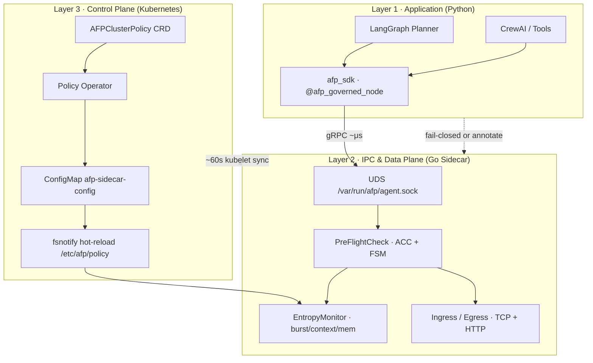

# Aegis Fabric Protocol (AFP)

**A runtime coordination layer for autonomous agent networks.**

> **"TCP governs packets. AFP governs optimizers."**
> *(TCP 治理数据包，AFP 治理优化器)*

Traditional Internet infrastructure (TCP, Istio, API gateways) assumes **passive executors**. Autonomous AI agents are **active optimizers** — they plan, recurse, and externalize cost. Without cybernetic constraints, that behavior produces **retry cascades, context explosions, recursive delegation storms, and coordination collapse.**

**Aegis Fabric Protocol (AFP)** introduces the *Consequence Persistence Layer (CPL)*: physical constraints and adaptive friction enforced by an out-of-band sidecar **before** intent becomes irreversible network I/O.

中文文档：`README.zh-CN.md` · **Whitepaper:** [AFP Technical Whitepaper](https://zenodo.org/records/20674352)

---

## Architecture: The Mental Model

AFP is a **three-layer mesh federation** — application intent, local data plane, and declarative control plane.



| Layer | Responsibility | Key artifacts |
|-------|----------------|---------------|
| **L1 Application** | Govern intent *before* tool storms and planner loops | `sdk/python/afp_sdk`, `@afp_governed_node`, `@afp_governed` |
| **L2 Data Plane** | Microsecond pre-flight + socket-level enforcement | `cmd/sidecar`, UDS IPC, `EntropyMonitor`, ACC/FSM |
| **L3 Control Plane** | Declarative policy law + hot-reloaded thresholds | `AFPClusterPolicy`, `cmd/operator`, ConfigMap volume |

**Design law:** *CRD is governance law. IPC is local execution. gRPC policy streams (Phase 2) are runtime injunctions — e.g. sub-second Kill Switch.*

---

## 10-Minute Quick Start

### Prerequisites

- Go 1.23+, Docker, Python 3.10+ (for SDK demos)
- Optional: [kind](https://kind.sigs.k8s.io/) for full K8s path

### Path A — Local sandbox (fastest)

Prove recursion breaker + intent burst **without Kubernetes**:

```bash
# Terminal 1 — sidecar with SDK IPC
AFP_IPC_SOCKET=/tmp/afp/agent.sock go run ./cmd/sidecar

# Terminal 2 — recursion depth tripwire (expect ISOLATED, exit 2)
AFP_IPC_SOCKET=/tmp/afp/agent.sock go run ./cmd/preflightclient \
  --recursion-depth 12

# Terminal 3 — intent burst tripwire (expect ISOLATED, exit 2)
AFP_IPC_SOCKET=/tmp/afp/agent.sock go run ./cmd/preflightclient \
  --estimated-tasks 10000

# Terminal 4 — LangGraph planner graceful degrade (annotate mode)
cd sdk/python && pip install grpcio protobuf langgraph -q
PYTHONPATH=. python examples/langgraph_planner.py
# expect: annotated-stop: ... recursion depth ...
```

### Path B — kind cluster (full mesh)

One script builds the image, loads it into kind, applies manifests, and runs in-pod demos:

```bash
./scripts/kind-quickstart.sh
```

Manual equivalent:

```bash
kind create cluster --name afp
docker build -t ghcr.io/filthymudblood/aegis-fabric-sidecar:latest .
kind load docker-image ghcr.io/filthymudblood/aegis-fabric-sidecar:latest --name afp

kubectl apply -f deploy/kubernetes/namespace.yaml
kubectl apply -f deploy/kubernetes/configmap-afp.yaml
kubectl apply -f deploy/kubernetes/crd/afpclusterpolicy.yaml
kubectl apply -f deploy/kubernetes/examples/afpclusterpolicy-enterprise.yaml
kubectl apply -f deploy/kubernetes/agent-pod-template.yaml

kubectl -n afp-system wait --for=condition=Ready pod -l app.kubernetes.io/component=agent-node --timeout=120s
POD=$(kubectl -n afp-system get pod -l app.kubernetes.io/component=agent-node -o jsonpath='{.items[0].metadata.name}')

# Dead-loop signal: recursion depth > policy limit
kubectl -n afp-system exec "$POD" -c afp-sidecar -- \
  preflightclient --recursion-depth 12

# Dynamic policy: tighten entropy limit cluster-wide
kubectl patch afpclusterpolicy enterprise-default --type merge \
  -p '{"spec":{"entropyLimit":0.80}}'
go run ./cmd/operator   # reconciles ConfigMaps; sidecar hot-reloads via fsnotify
```

See [deploy/kubernetes/README.md](deploy/kubernetes/README.md) for topology details.

---

## Enterprise Operations Handbook

### `AFP_SDK_FAIL_MODE` — open vs closed

| Mode | Behavior when Sidecar IPC is unreachable | Typical use |
|------|------------------------------------------|-------------|
| **`open`** (dev default) | Log warning, **allow intent**; network layer may still block | Local dev, staged rollouts, non-critical sandboxes |
| **`closed`** (enterprise default) | Raise `AFPInfrastructureError`, **halt intent** | Finance, healthcare, production multi-agent meshes |

In Kubernetes we default agents to **`closed`** via `afp-agent-config` ConfigMap. A missing UDS socket must not silently allow a planner to spawn 10,000 internal tasks.

```yaml
# deploy/kubernetes/configmap-afp.yaml
data:
  AFP_SDK_FAIL_MODE: "closed"
  AFP_IPC_SOCKET: "/var/run/afp/agent.sock"
```

### Tuning `entropyLimit` (physical red line)

`entropyLimit` (env: `AFP_ENTROPY_LIMIT`, default **0.95**) is the **preemptive circuit breaker** threshold. Effective entropy is the `max()` of:

- tool concurrency pressure
- memory / cgroup pressure
- SDK-reported `context_memory_bytes`
- planner `estimated_tasks` burst factor

| Profile | `entropyLimit` | When to use |
|---------|----------------|-------------|
| **Exploration** | 0.98 | R&D clusters, tolerant of occasional throttling |
| **Enterprise default** | 0.95 | Balanced safety vs throughput |
| **High-assurance** | 0.85–0.90 | Noisy neighbor isolation, strict SLO environments |

Cluster-wide changes:

```yaml
apiVersion: afp.aegis-fabric.io/v1alpha1
kind: AFPClusterPolicy
metadata:
  name: enterprise-default
spec:
  targetNamespaces: [afp-system]
  entropyLimit: 0.95
  maxRecursionDepth: 10
  runMode: enterprise-mesh
  failMode: closed
```

Operator reconciles → ConfigMap files under `/etc/afp/policy` → sidecar `fsnotify` reload (**no pod restart** for threshold changes). Expect **~60s kubelet propagation**; Phase 2 gRPC `StreamPolicyUpdates` covers sub-second Kill Switch.

### LangGraph graceful degradation

Use `on_quota_exceeded="annotate"` to inject `afp_blocked` into graph state instead of crashing the pipeline — route to human-in-the-loop or fallback nodes:

```python
from afp_sdk import afp_governed_node

@afp_governed_node(on_quota_exceeded="annotate", estimated_tasks=10)
def planner_node(state):
    ...
```

---

## Empirical Proof

Monte Carlo stress test: **1,000 runs × 500 nodes × 5% malicious × 100 epochs**.

| Network | Outcome |
|---------|---------|
| **Baseline** | Survivors **500 → 2.05** (~0.4%) — coordination collapse |
| **AFP** | **500.00** survivors (**100%** topological survival) |

```bash
go run ./cmd/simulator
make demo-report   # Grafana + Prometheus evidence bundle
```

Full reproducible demo matrix: [Empirical Proof details](#full-empirical-proof-matrix) below.

---

## Python SDK

```bash
cd sdk/python
pip install grpcio protobuf
./scripts/gen_proto.sh
PYTHONPATH=. python -c "from afp_sdk import AFPSidecarClient; print('ok')"
make sdk-test
```

```python
from afp_sdk import AFPSidecarClient, afp_governed_node

afp = AFPSidecarClient()
afp.report_state(current_recursion_depth=2, context_memory_bytes=1_048_576)
afp.pre_flight_check(estimated_tasks=50)
```

Docs: [sdk/python/README.md](sdk/python/README.md)

---

## Kubernetes

| Resource | Path |
|----------|------|
| Pod / Deployment template | `deploy/kubernetes/agent-pod-template.yaml` |
| ConfigMaps | `deploy/kubernetes/configmap-afp.yaml` |
| CRD | `deploy/kubernetes/crd/afpclusterpolicy.yaml` |
| Operator + RBAC | `deploy/kubernetes/operator-deployment.yaml` |
| Example policy | `deploy/kubernetes/examples/afpclusterpolicy-enterprise.yaml` |

```bash
make build    # includes sidecar + operator + preflightclient
```

---

## Demo Agent Image (roadmap)

**Recommendation: yes — ship `afp-demo-agent:latest`.**

Today, the LangGraph dead-loop demo lives in `sdk/python/examples/langgraph_planner.py` and requires a local Python environment. For conference rooms and SRE onboarding, a **pre-baked demo agent image** dramatically lowers friction:

- `kubectl apply` and immediately watch `afp_blocked` without `pip install`
- CI can regression-test the full Pod + UDS + SDK path
- Sidecar image already ships `preflightclient` for low-level proofs; demo-agent covers **application-layer** narrative

Planned: `Dockerfile.demo-agent` → `ghcr.io/filthymudblood/afp-demo-agent:latest` running the LangGraph planner loop on an interval. **Until then**, use `preflightclient` in-cluster (`./scripts/kind-quickstart.sh`) or the local Python example.

---

## Project Layout

```text
aegis-fabric/
├─ api/afp/v1/           # protobuf: governance, sdk_ipc, cluster_policy
├─ cmd/
│  ├─ sidecar/           # Go data plane + UDS IPC server
│  ├─ operator/          # AFPClusterPolicy → ConfigMap reconciler
│  ├─ preflightclient/   # IPC blackbox CLI
│  ├─ http_gateway/      # L7 wrapper demo
│  └─ simulator/         # Monte Carlo engine
├─ internal/
│  ├─ controller/        # K8s policy operator
│  ├─ dataplane/         # ingress, egress, pre-flight ACC
│  ├─ ipc/               # UDS gRPC service
│  └─ config/            # runtime policy hot-reload
├─ sdk/python/afp_sdk/   # Python SDK + LangGraph adapters
├─ deploy/kubernetes/    # production IaC
├─ scripts/              # verification + kind-quickstart.sh
└─ artifacts/            # demo reports
```

---

## Run Modes

| `AFP_RUN_MODE` | Behavior |
|----------------|----------|
| `enterprise-mesh` | AFP-Core: congestion, recursion, entropy (default) |
| `open-exchange` | Core + zero-trust stranger tax |

---

## Full Empirical Proof Matrix

| Layer | Command | Expected signal |
|-------|---------|-----------------|
| L7 blackbox | `docker compose up -d && ./scripts/verify_http_gateway.sh` | `200` / `508` / `403` |
| Governance kernel | `./scripts/verify_modes.sh` · `./scripts/verify_recursion_loop.sh` | mode gates + recursion breaker |
| Monte Carlo | `go run ./cmd/simulator` | AFP >> Baseline survival |
| Telemetry | `make demo-report` | `artifacts/report/` |

---

## Observability

- Sidecar metrics: `http://<pod>:9090/metrics`
- Key series: `afp_preflight_actions_total`, `afp_ingress_actions_total`, `afp_injected_delay_milliseconds`
- Local stack: `deploy/monitor/docker-compose.yml`

---

## Implementation Status

**Shipped:** TCP/LV data plane · ACC/FSM · SDK IPC · LangGraph adapter · K8s sidecar co-deploy · CRD operator · ConfigMap hot-reload

**Hardening:** full cgroup reader · production crypto verification · iptables/eBPF socket hijack · gRPC `StreamPolicyUpdates` (Phase 2)

---

## License

Apache License 2.0 — see [LICENSE](LICENSE).
