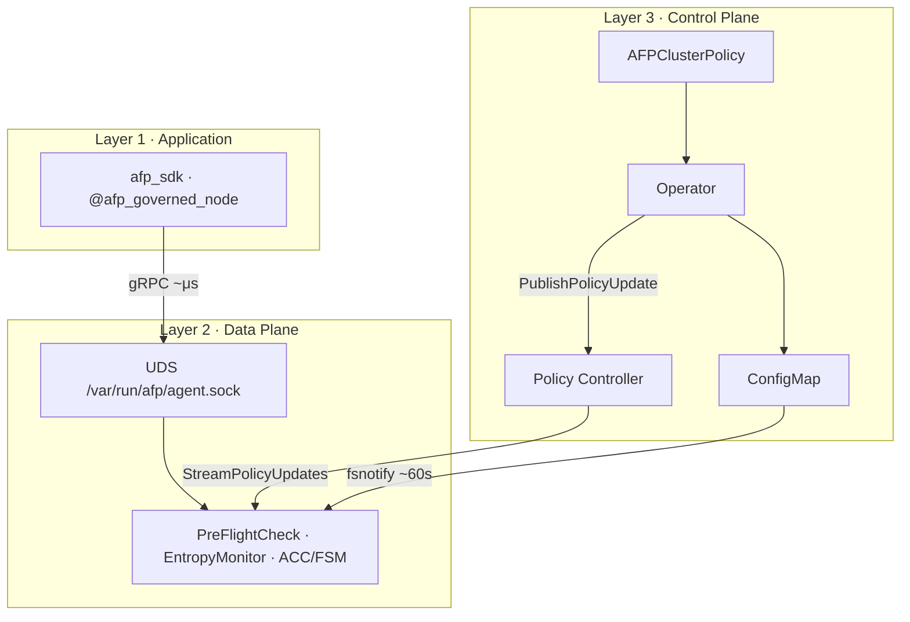

# Aegis Fabric Protocol (AFP)

[](https://github.com/FilthyMudblood/aegis-fabric/actions/workflows/docker-publish.yml)
[](https://ghcr.io/filthymudblood/aegis-fabric-sidecar)
[](https://ghcr.io/filthymudblood/aegis-fabric-operator)
[](https://ghcr.io/filthymudblood/afp-demo-agent)
[](LICENSE)

### **The Physical Brakes for Enterprise Agent Networks**

> **"TCP governs packets. AFP governs optimizers."**
> *(TCP 治理数据包，AFP 治理优化器)*

**Aegis Fabric Protocol (AFP)** is a Kubernetes-native **Consequence Persistence Layer (CPL)** — an out-of-band sidecar that kills planner dead-loops, intent bursts, and recursive delegation storms **before** they become irreversible network I/O.

中文文档 · [`README.zh-CN.md`](README.zh-CN.md) · Whitepapers · **[v2 Protocol Edition](docs/whitepaper-v2/)** · [v1 on Zenodo](https://zenodo.org/records/20674352)

---

## The Problem

Your AI agents are not HTTP clients. They are **active optimizers** — they plan, recurse, spawn sub-tasks, and externalize cost.

When an agent goes rogue:

| Symptom | Why traditional infra fails |
|---------|----------------------------|
| **Planner dead-loop** | LangGraph keeps running; the process stays alive; no CrashLoopBackOff |
| **Intent explosion** | 10,000 internal tasks never hit the network — firewalls see nothing |
| **Context avalanche** | Memory pressure builds inside the pod; L7 gateways arrive too late |
| **Argent Signaling Protocol (ASP)** | By the time HTTP returns `508`, the optimizer has already committed |

You do not have a networking problem. You have an **optimizer governance** problem.

## The Solution

AFP installs a **Go sidecar** beside every agent pod. Before a LangGraph node or CrewAI tool fires, the Python SDK asks the sidecar one question over a **microsecond UDS corridor**:

> *"Is this intent physically safe to execute?"*

If not → **ISOLATED** at the source. No OOM. No retry cascade. No silent `$50k` token burn.

```text
Application intent  →  UDS PreFlightCheck  →  ALLOW | THROTTLE | ISOLATED
                              ↑
                    CRD law + gRPC injunction
```

---

## AFP vs Argent Signaling Protocol (ASP)

**Short answer:** [Argent Signaling Protocol (ASP)](https://zenodo.org/records/20674352) and peers govern *how agents talk*. AFP governs *whether an intent may execute at all* — before packets, before HTTP, before the optimizer commits.

ASP and similar application-layer stacks solve **traffic-light problems** for agents that are already at the intersection:

- Discovery and capability exchange
- Multi-turn session state and collaboration semantics
- Negotiation of *exposed* intents between peers

That is necessary infrastructure. It is **not sufficient** for physical safety inside a single pod:

| Failure mode | ASP / in-band signaling | L7 gateway / WAF | **AFP (out-of-band CPL)** |
|--------------|-------------------------|------------------|---------------------------|
| Planner `while True` recursion | Session may still look valid | No HTTP yet to inspect | **Block at next node via UDS PreFlight** |
| 10,000 internal `estimated_tasks` | No wire traffic to signal | Firewall sees nothing | **Entropy / depth limits before I/O** |
| Context avalanche toward OOM | ACTIVE session, green health checks | Rate limit is QPS, not bytes×depth | **cgroup-aware EntropyMonitor** |
| Emergency fleet clamp | Policy change is conversational | Per-route config push | **Kill Switch + CRD overlay in <1s** |

```text
         Collaboration semantics          Physical consequence
         ───────────────────────          ──────────────────────
         ASP · A2A protocols      +       AFP sidecar · PreFlightCheck
         (who talks, about what)          (may this intent run?)
                    │                              │
                    └──────── complementary ───────┘
                              not substitutes
```

**Design stance:** Signaling is not the enemy. Treating it as the *only* line of defense is the architectural mistake. AFP sits **below** application protocols — same relationship Envoy has to HTTP, or cgroups have to your process: out-of-band, microsecond, fail-closed.

Deep dive: [Whitepaper v2 · Chapter 1 — The Optimization Crisis](docs/whitepaper-v2/chapter-01-optimization-crisis.md) · [full index](docs/whitepaper-v2/)

---

## 10-Minute Quickstart

### Prerequisites

- [Docker](https://docs.docker.com/get-docker/)
- [kind](https://kind.sigs.k8s.io/) or Minikube
- `kubectl`, `make`

### One command

```bash
git clone https://github.com/FilthyMudblood/aegis-fabric.git && cd aegis-fabric
make kind-quickstart
```

This builds the full stack (sidecar · operator · policy-controller · demo-agent), loads it into kind, applies all manifests, and runs live interception demos.

### The "Aha!" Moment

Tail the demo agent — a LangGraph planner deliberately seeded to recurse:

```bash
kubectl -n afp-system logs -f deploy/afp-agent-node -c agent-core
```

**You should see this within seconds:**

```text
afp-demo-agent: waiting for sidecar IPC at /var/run/afp/agent.sock
afp-demo-agent: sidecar socket ready
--- langgraph planner demo (initial_depth=10) ---
[AFP SDK] LangGraph node blocked: afp-core: recursion depth exceeded physical limit, intent loop detected
annotated-stop: afp-core: recursion depth exceeded physical limit, intent loop detected
```

| Log line | What just happened |
|----------|-------------------|
| `socket ready` | `emptyDir` UDS mount — Python agent ↔ Go sidecar, **no TCP stack** |
| `LangGraph node blocked` | `maxRecursionDepth: 10` tripped; intent killed **in the cradle** |
| `annotated-stop` | `@afp_governed_node(annotate)` — no crash, no OOM, graceful state-machine stop |

**Three layers. One log stream. Zero hand-waving.**

### Feel the sub-second control plane

**Option A — patch the CRD (declarative, now streams in <1s):**

```bash
kubectl patch afpclusterpolicy enterprise-default --type merge \
  -p '{"spec":{"maxRecursionDepth":5,"entropyLimit":0.80}}'

kubectl -n afp-system logs -f deploy/afp-agent-node -c afp-sidecar
# → policy stream update applied ... revision=N
```

Path: `kubectl apply` → Operator → `PublishPolicyUpdate` → Policy Controller Hub → every Sidecar.

**Option B — emergency Kill Switch (operational):**

```bash
kubectl -n afp-system port-forward svc/afp-policy-controller 8090:8090 &
go run ./cmd/controlplane/policyctl --controller 127.0.0.1:8090 --kill-switch

# Every pre-flight check returns ISOLATED immediately.
# Clear overlay and fall back to ConfigMap law:
go run ./cmd/controlplane/policyctl --controller 127.0.0.1:8090 --clear
```

### Local sandbox (no Kubernetes)

```bash
# Terminal 1
AFP_IPC_SOCKET=/tmp/afp/agent.sock go run ./cmd/dataplane/sidecar

# Terminal 2 — recursion breaker
AFP_IPC_SOCKET=/tmp/afp/agent.sock go run ./cmd/dataplane/preflightclient --recursion-depth 12

# Terminal 3 — LangGraph annotate mode
cd sdk/python && pip install grpcio protobuf langgraph -q
PYTHONPATH=. python examples/langgraph_planner.py
```

---

## Architecture at a Glance

### Three layers



| Layer | Role | Key artifacts |
|-------|------|---------------|
| **L1 Application** | Govern intent before tool storms | `sdk/python/afp_sdk`, LangGraph adapter |
| **L2 Data Plane** | Microsecond pre-flight enforcement | `cmd/dataplane/sidecar`, UDS IPC |
| **L3 Control Plane** | Declarative law + runtime injunction | CRD, Operator, Policy Controller |

### Dual-Source Policy Merge

The same pattern Envoy xDS uses — **persistent law** plus **runtime injunction**:

```text
┌─────────────────────────────────────────────────────────────┐
│                    RuntimePolicy (effective)                 │
│                                                             │
│   Base Layer (law)          Overlay Layer (injunction)      │
│   ─────────────────         ──────────────────────────      │
│   CRD → Operator            Policy Controller gRPC stream │
│        → ConfigMap                 ↓                        │
│        → fsnotify (~60s)     Kill Switch / emergency clamp  │
│                                                             │
│   Fail-Safe: controller offline → ConfigMap still governs  │
└─────────────────────────────────────────────────────────────┘
```

| Source | Latency | Purpose |
|--------|---------|---------|
| **Base Layer** | ~60s (kubelet ConfigMap sync) | Durable law. Survives controller outages. |
| **Overlay Layer** | Sub-second (gRPC `StreamPolicyUpdates`) | CRD push, Kill Switch, incident response. |

**Design law:** *CRD is governance law. ConfigMap is the fail-safe floor. gRPC stream is the runtime injunction.*

Security: Sidecars authenticate with **projected ServiceAccount tokens** validated via Kubernetes `TokenReview`.

---

## Container Images (GHCR)

Published automatically on every push to `main`:

| Image | Command |
|-------|---------|
| [`aegis-fabric-sidecar`](https://ghcr.io/filthymudblood/aegis-fabric-sidecar) | `sidecar` · `policy-controller` · `preflightclient` · `policyctl` |
| [`aegis-fabric-operator`](https://ghcr.io/filthymudblood/aegis-fabric-operator) | `operator` |
| [`afp-demo-agent`](https://ghcr.io/filthymudblood/afp-demo-agent) | LangGraph dead-loop demo |

```bash
docker pull ghcr.io/filthymudblood/aegis-fabric-sidecar:latest
docker pull ghcr.io/filthymudblood/aegis-fabric-operator:latest
docker pull ghcr.io/filthymudblood/afp-demo-agent:latest
```

---

## Enterprise Handbook

### `AFP_SDK_FAIL_MODE`

| Mode | Sidecar unreachable | Use case |
|------|---------------------|----------|
| **`open`** | Warn, allow intent | Local dev |
| **`closed`** | Halt intent (`AFPInfrastructureError`) | Production K8s default |

### `entropyLimit` tuning

Default **0.95** — preemptive circuit breaker on tool concurrency, memory pressure, context bytes, and `estimated_tasks` burst.

```yaml
apiVersion: afp.aegis-fabric.io/v1alpha1
kind: AFPClusterPolicy
metadata:
  name: enterprise-default
spec:
  entropyLimit: 0.95
  maxRecursionDepth: 10
  failMode: closed
```

### LangGraph graceful degradation

```python
@afp_governed_node(on_quota_exceeded="annotate")
def planner_node(state):
    ...
```

Blocked intents become `afp_blocked` state — route to human-in-the-loop instead of crashing the graph.

---

## Empirical Proof

Monte Carlo: **1,000 runs × 500 nodes × 5% malicious × 100 epochs**

| Network | Survivors |
|---------|-----------|
| Baseline | **500 → 2.05** (~0.4%) |
| **AFP** | **500.00** (100%) |

```bash
go run ./cmd/demo/simulator && make demo-report
```

---

## Project Layout

See **[ARCHITECTURE.md](ARCHITECTURE.md)** for the protocol specification (L0–L5 stack, CPL, SEA, dual-path enforcement).  
See **[CODEBASE.md](CODEBASE.md)** for the repository file map. Summary:

```text
aegis-fabric/
├─ ARCHITECTURE.md              # protocol spec (CPL · SEA · CVP · PreFlight)
├─ api/afp/v1/                    # protobuf contracts
├─ cmd/
│  ├─ dataplane/                  # sidecar, preflightclient, egressclient
│  ├─ controlplane/               # operator, policy-controller, policyctl
│  └─ demo/                       # simulator, http_gateway, harnesses
├─ internal/                      # dataplane, ipc, policyplane, controller, …
├─ sdk/python/afp_sdk/            # Python SDK + LangGraph adapter
├─ deploy/kubernetes/             # production manifests
├─ Dockerfile.demo-agent          # zero-setup demo image
└─ scripts/kind-quickstart.sh
```

**K8s deep-dive:** [`deploy/kubernetes/README.md`](deploy/kubernetes/README.md) · **Python SDK:** [`sdk/python/README.md`](sdk/python/README.md)

---

## Observability

```bash
kubectl -n afp-system port-forward deploy/afp-agent-node 9090:9090
curl -s localhost:9090/metrics | grep afp_preflight
```

Key series: `afp_preflight_actions_total`, `afp_ingress_actions_total`

---

## Status

| Phase | Delivered |
|-------|-----------|
| **Phase 1** | Sidecar data plane · SDK IPC · LangGraph adapter · K8s co-deploy · CRD Operator · ConfigMap hot-reload · demo-agent |
| **Phase 2** | `StreamPolicyUpdates` · Operator→Controller bridge · SA TokenReview · revision replay · **mTLS** · **status writeback** · **delete propagation** · GHCR CI |

**Frozen after PR-6c.** Production hardening: [`ROADMAP.md`](ROADMAP.md) · Theory: [Whitepaper v2.0 Protocol Edition](docs/whitepaper-v2/) · v1 archive: [Zenodo](https://zenodo.org/records/20674352)

---

## License

Apache License 2.0 — see [LICENSE](LICENSE).
