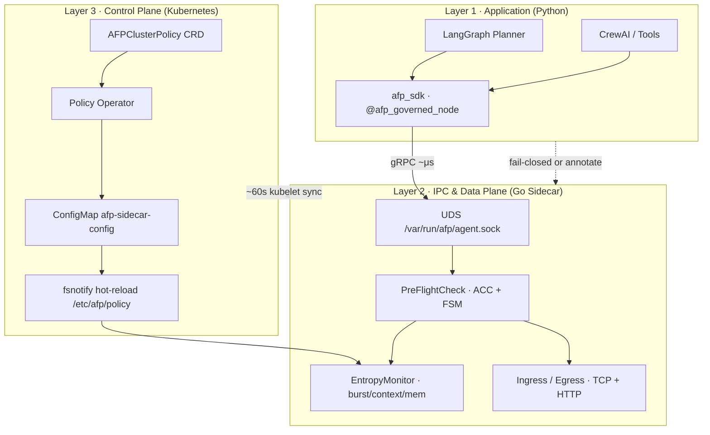

# Aegis Fabric Protocol (AFP)

**A runtime coordination layer for autonomous agent networks.**

> **"TCP governs packets. AFP governs optimizers."**
> *(TCP 治理数据包，AFP 治理优化器)*

Traditional Internet infrastructure (TCP, Istio, API gateways) assumes **passive executors**. Autonomous AI agents are **active optimizers** — they plan, recurse, and externalize cost. Without cybernetic constraints, that behavior produces **retry cascades, context explosions, recursive delegation storms, and coordination collapse.**

**Aegis Fabric Protocol (AFP)** introduces the *Consequence Persistence Layer (CPL)*: physical constraints and adaptive friction enforced by an out-of-band sidecar **before** intent becomes irreversible network I/O.

中文文档：`README.zh-CN.md` · **Whitepaper:** [AFP Technical Whitepaper](https://zenodo.org/records/20674352)

---

## Architecture: The Mental Model

AFP is a **three-layer mesh federation** — application intent, local data plane, and declarative control plane.



| Layer | Responsibility | Key artifacts |
|-------|----------------|---------------|
| **L1 Application** | Govern intent *before* tool storms and planner loops | `sdk/python/afp_sdk`, `@afp_governed_node`, `@afp_governed` |
| **L2 Data Plane** | Microsecond pre-flight + socket-level enforcement | `cmd/sidecar`, UDS IPC, `EntropyMonitor`, ACC/FSM |
| **L3 Control Plane** | Declarative policy law + hot-reloaded thresholds | `AFPClusterPolicy`, `cmd/operator`, ConfigMap volume |

**Design law:** *CRD is governance law. IPC is local execution. gRPC policy streams (Phase 2) are runtime injunctions — e.g. sub-second Kill Switch.*

---

## 10-Minute Quick Start

### Prerequisites

- Go 1.23+, Docker, Python 3.10+ (for SDK demos)
- Optional: [kind](https://kind.sigs.k8s.io/) for full K8s path

### Path A — Local sandbox (fastest)

Prove recursion breaker + intent burst **without Kubernetes**:

```bash
# Terminal 1 — sidecar with SDK IPC
AFP_IPC_SOCKET=/tmp/afp/agent.sock go run ./cmd/sidecar

# Terminal 2 — recursion depth tripwire (expect ISOLATED, exit 2)
AFP_IPC_SOCKET=/tmp/afp/agent.sock go run ./cmd/preflightclient \
  --recursion-depth 12

# Terminal 3 — intent burst tripwire (expect ISOLATED, exit 2)
AFP_IPC_SOCKET=/tmp/afp/agent.sock go run ./cmd/preflightclient \
  --estimated-tasks 10000

# Terminal 4 — LangGraph planner graceful degrade (annotate mode)
cd sdk/python && pip install grpcio protobuf langgraph -q
PYTHONPATH=. python examples/langgraph_planner.py
# expect: annotated-stop: ... recursion depth ...
```

### Path B — kind cluster (full mesh)

One script builds both images, loads them into kind, applies manifests, and runs in-pod demos:

```bash
make kind-quickstart
# equivalent: ./scripts/kind-quickstart.sh
```

Then tail the application-layer proof:

```bash
kubectl -n afp-system logs -f deploy/afp-agent-node -c agent-core
```

#### Expected output (black-box replay)

This is the **buyer demo** — copy/paste evidence from a live cluster. Three layers bite in one log stream:

```text
afp-demo-agent: waiting for sidecar IPC at /var/run/afp/agent.sock
afp-demo-agent: sidecar socket ready
--- langgraph planner demo (initial_depth=10) ---
[AFP SDK] LangGraph node blocked: afp-core: recursion depth exceeded physical limit, intent loop detected
annotated-stop: afp-core: recursion depth exceeded physical limit, intent loop detected
```

| Log line | Layer | What it proves |
|----------|-------|----------------|
| `waiting … agent.sock` → `socket ready` | **L2 IPC (PR-4)** | `emptyDir` UDS mount works; Python agent and Go sidecar share a microsecond IPC corridor — no TCP stack |
| `LangGraph node blocked … ISOLATED` | **L1 + L2 + L3 (PR-1, PR-5)** | `initial_depth=10` hits `maxRecursionDepth: 10`; SDK `pre_flight_check()` → Sidecar `EvaluatePreFlight` → hard stop before intent becomes I/O |
| `annotated-stop: …` | **L1 adapter (PR-3)** | `@afp_governed_node(on_quota_exceeded="annotate")` — no OOM, no CrashLoop; graceful state-machine landing |

Manual equivalent:

```bash
kind create cluster --name afp
make demo-agent-docker
docker build -t ghcr.io/filthymudblood/aegis-fabric-sidecar:latest .
kind load docker-image ghcr.io/filthymudblood/aegis-fabric-sidecar:latest --name afp
kind load docker-image ghcr.io/filthymudblood/afp-demo-agent:latest --name afp

kubectl apply -f deploy/kubernetes/namespace.yaml
kubectl apply -f deploy/kubernetes/configmap-afp.yaml
kubectl apply -f deploy/kubernetes/crd/afpclusterpolicy.yaml
kubectl apply -f deploy/kubernetes/examples/afpclusterpolicy-enterprise.yaml
kubectl apply -f deploy/kubernetes/agent-pod-demo.yaml

kubectl -n afp-system wait --for=condition=Ready pod -l app.kubernetes.io/component=agent-node --timeout=180s
kubectl -n afp-system logs -f deploy/afp-agent-node -c agent-core
```

**Public images (roadmap):** publish `ghcr.io/filthymudblood/afp-demo-agent:latest` and the sidecar image to GHCR so newcomers can `kubectl apply` without a local `docker build`. Until then, `make kind-quickstart` builds and loads both images automatically.

See [deploy/kubernetes/README.md](deploy/kubernetes/README.md) for topology details.

---

## Enterprise Operations Handbook

### `AFP_SDK_FAIL_MODE` — open vs closed

| Mode | Behavior when Sidecar IPC is unreachable | Typical use |
|------|------------------------------------------|-------------|
| **`open`** (dev default) | Log warning, **allow intent**; network layer may still block | Local dev, staged rollouts, non-critical sandboxes |
| **`closed`** (enterprise default) | Raise `AFPInfrastructureError`, **halt intent** | Finance, healthcare, production multi-agent meshes |

In Kubernetes we default agents to **`closed`** via `afp-agent-config` ConfigMap. A missing UDS socket must not silently allow a planner to spawn 10,000 internal tasks.

```yaml
# deploy/kubernetes/configmap-afp.yaml
data:
  AFP_SDK_FAIL_MODE: "closed"
  AFP_IPC_SOCKET: "/var/run/afp/agent.sock"
```

### Tuning `entropyLimit` (physical red line)

`entropyLimit` (env: `AFP_ENTROPY_LIMIT`, default **0.95**) is the **preemptive circuit breaker** threshold. Effective entropy is the `max()` of:

- tool concurrency pressure
- memory / cgroup pressure
- SDK-reported `context_memory_bytes`
- planner `estimated_tasks` burst factor

| Profile | `entropyLimit` | When to use |
|---------|----------------|-------------|
| **Exploration** | 0.98 | R&D clusters, tolerant of occasional throttling |
| **Enterprise default** | 0.95 | Balanced safety vs throughput |
| **High-assurance** | 0.85–0.90 | Noisy neighbor isolation, strict SLO environments |

Cluster-wide changes:

```yaml
apiVersion: afp.aegis-fabric.io/v1alpha1
kind: AFPClusterPolicy
metadata:
  name: enterprise-default
spec:
  targetNamespaces: [afp-system]
  entropyLimit: 0.95
  maxRecursionDepth: 10
  runMode: enterprise-mesh
  failMode: closed
```

Operator reconciles → ConfigMap files under `/etc/afp/policy` → sidecar `fsnotify` reload (**no pod restart** for threshold changes). Expect **~60s kubelet propagation**; Phase 2 gRPC `StreamPolicyUpdates` covers sub-second Kill Switch.

### LangGraph graceful degradation

Use `on_quota_exceeded="annotate"` to inject `afp_blocked` into graph state instead of crashing the pipeline — route to human-in-the-loop or fallback nodes:

```python
from afp_sdk import afp_governed_node

@afp_governed_node(on_quota_exceeded="annotate", estimated_tasks=10)
def planner_node(state):
    ...
```

---

## Empirical Proof

Monte Carlo stress test: **1,000 runs × 500 nodes × 5% malicious × 100 epochs**.

| Network | Outcome |
|---------|---------|
| **Baseline** | Survivors **500 → 2.05** (~0.4%) — coordination collapse |
| **AFP** | **500.00** survivors (**100%** topological survival) |

```bash
go run ./cmd/simulator
make demo-report   # Grafana + Prometheus evidence bundle
```

Full reproducible demo matrix: [Empirical Proof details](#full-empirical-proof-matrix) below.

---

## Python SDK

```bash
cd sdk/python
pip install grpcio protobuf
./scripts/gen_proto.sh
PYTHONPATH=. python -c "from afp_sdk import AFPSidecarClient; print('ok')"
make sdk-test
```

```python
from afp_sdk import AFPSidecarClient, afp_governed_node

afp = AFPSidecarClient()
afp.report_state(current_recursion_depth=2, context_memory_bytes=1_048_576)
afp.pre_flight_check(estimated_tasks=50)
```

Docs: [sdk/python/README.md](sdk/python/README.md)

---

## Kubernetes

| Resource | Path |
|----------|------|
| Pod template (generic) | `deploy/kubernetes/agent-pod-template.yaml` |
| **Demo deployment** | `deploy/kubernetes/agent-pod-demo.yaml` |
| ConfigMaps | `deploy/kubernetes/configmap-afp.yaml` |
| CRD | `deploy/kubernetes/crd/afpclusterpolicy.yaml` |
| Operator + RBAC | `deploy/kubernetes/operator-deployment.yaml` |
| Example policy | `deploy/kubernetes/examples/afpclusterpolicy-enterprise.yaml` |

```bash
make build    # includes sidecar + operator + preflightclient
```

---

## Demo Agent Image

Pre-baked LangGraph planner for zero-setup Kubernetes demos — no local Python required.

```bash
make demo-agent-docker
# or full kind path (builds sidecar + demo agent):
make kind-quickstart
```

| Image | Purpose |
|-------|---------|
| `ghcr.io/filthymudblood/aegis-fabric-sidecar:latest` | L2 data plane + `preflightclient` |
| `ghcr.io/filthymudblood/afp-demo-agent:latest` | L1 LangGraph `@afp_governed_node` loop |

Build from `Dockerfile.demo-agent`; deploy with `deploy/kubernetes/agent-pod-demo.yaml`.

Watch application-layer interception:

```bash
kubectl -n afp-system logs -f deploy/afp-agent-node -c agent-core
# expect: annotated-stop: ... recursion depth exceeded ...
```

Local one-shot (sidecar required):

```bash
cd sdk/python && PYTHONPATH=. python examples/langgraph_planner.py
cd sdk/python && PYTHONPATH=. python examples/langgraph_planner.py --loop --interval 10
```

---

## Project Layout

```text
aegis-fabric/
├─ api/afp/v1/           # protobuf: governance, sdk_ipc, cluster_policy
├─ cmd/
│  ├─ sidecar/           # Go data plane + UDS IPC server
│  ├─ operator/          # AFPClusterPolicy → ConfigMap reconciler
│  ├─ policy-controller/ # Phase 2 gRPC policy stream server
│  ├─ policyctl/         # Kill Switch / emergency override CLI
│  ├─ preflightclient/   # IPC blackbox CLI
│  ├─ http_gateway/      # L7 wrapper demo
│  └─ simulator/         # Monte Carlo engine
├─ internal/
│  ├─ controller/        # K8s policy operator
│  ├─ dataplane/         # ingress, egress, pre-flight ACC
│  ├─ ipc/               # UDS gRPC service
│  └─ config/            # runtime policy hot-reload
├─ sdk/python/afp_sdk/   # Python SDK + LangGraph adapters
├─ deploy/kubernetes/    # production IaC
├─ Dockerfile.demo-agent # LangGraph demo agent image
├─ scripts/              # verification + kind-quickstart.sh
└─ artifacts/            # demo reports
```

---

## Run Modes

| `AFP_RUN_MODE` | Behavior |
|----------------|----------|
| `enterprise-mesh` | AFP-Core: congestion, recursion, entropy (default) |
| `open-exchange` | Core + zero-trust stranger tax |

---

## Full Empirical Proof Matrix

| Layer | Command | Expected signal |
|-------|---------|-----------------|
| L7 blackbox | `docker compose up -d && ./scripts/verify_http_gateway.sh` | `200` / `508` / `403` |
| Governance kernel | `./scripts/verify_modes.sh` · `./scripts/verify_recursion_loop.sh` | mode gates + recursion breaker |
| Monte Carlo | `go run ./cmd/simulator` | AFP >> Baseline survival |
| Telemetry | `make demo-report` | `artifacts/report/` |

---

## Observability

- Sidecar metrics: `http://<pod>:9090/metrics`
- Key series: `afp_preflight_actions_total`, `afp_ingress_actions_total`, `afp_injected_delay_milliseconds`
- Local stack: `deploy/monitor/docker-compose.yml`

---

## Implementation Status

**Phase 1 — shipped:** TCP/LV data plane · ACC/FSM · SDK IPC · LangGraph adapter · K8s sidecar co-deploy · CRD operator · ConfigMap hot-reload · demo-agent image

**Phase 2 — in progress (PR-6a + PR-6b shipped):** `StreamPolicyUpdates` · policy-controller · Operator→Controller bridge · SA TokenReview · revision replay · GHCR CI

| Phase 1 (law) | Phase 2 (injunction) |
|---------------|----------------------|
| `AFPClusterPolicy` CRD → Operator → ConfigMap | Operator also `PublishPolicyUpdate` → sub-second mesh |
| `fsnotify` hot-reload (~60s kubelet sync) | Fail-safe fallback when controller offline |
| Declarative threshold tuning | `policyctl --kill-switch` emergency clamp |

```text
kubectl apply AFPClusterPolicy
  → Operator reconcile (ConfigMap + gRPC PublishPolicyUpdate)
  → Policy Controller Hub → all Sidecars
```

```bash
make kind-quickstart   # full stack: sidecar + operator + demo-agent + controller
```

**GHCR images (auto-published on `main`):** `aegis-fabric-sidecar`, `aegis-fabric-operator`, `afp-demo-agent`

**Phase 2 — next (PR-6c):** transport mTLS · operator status feedback · CRD delete propagation

**Hardening (parallel):** full cgroup reader · production crypto verification · iptables/eBPF socket hijack

---

## License

Apache License 2.0 — see [LICENSE](LICENSE).
