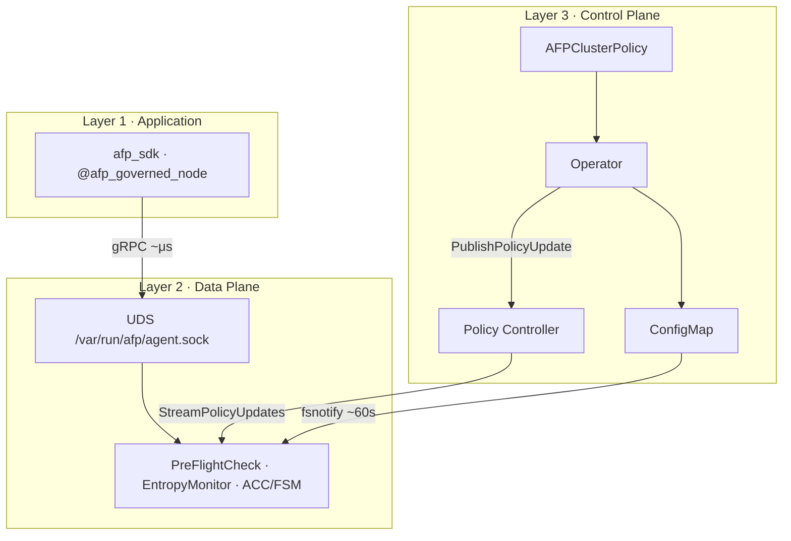

# Aegis Fabric Protocol (AFP)

[Docker Publish](https://github.com/FilthyMudblood/aegis-fabric/actions/workflows/docker-publish.yml)
[GHCR Sidecar](https://ghcr.io/filthymudblood/aegis-fabric-sidecar)
[GHCR Operator](https://ghcr.io/filthymudblood/aegis-fabric-operator)
[GHCR Demo Agent](https://ghcr.io/filthymudblood/afp-demo-agent)
[License](LICENSE)

### **The Physical Brakes for Multi-Agent Systems**

*Enterprise today · P2P-ready by protocol*

> **"TCP governs packets. AFP governs optimizers."**
> *(TCP 治理数据包，AFP 治理优化器)*

**Aegis Fabric Protocol (AFP)** is a **Consequence Persistence Layer (CPL)** — the missing runtime brake between *agents can talk* and *the mesh survives*. Reference deployments use a Kubernetes-native sidecar; the **protocol** is the same for enterprise multi-agent and open P2P agent meshes.

中文文档 · [`README.zh-CN.md`](README.zh-CN.md) · Whitepapers · **[v2 Protocol Edition](docs/whitepaper-v2/whitepaper-v2-protocol-edition.md)** · [v1 on Zenodo](https://zenodo.org/records/20674352)

### The gap

Multi-agent stacks solve **planning** (LangGraph, CrewAI) and **messaging** (gRPC, Kafka, MCP, ASP). None solve **coordination runtime**:

> *May this step execute—and do consequences persist when it does not?*


| Layer                        | Status                           |
| ---------------------------- | -------------------------------- |
| Transport                    | Solved — bytes move              |
| Semantic collaboration       | Evolving — ASP, A2A, MCP         |
| **Coordination runtime law** | **Missing — AFP fills this gap** |


| Mode                       | What AFP answers                                                                                    |
| -------------------------- | --------------------------------------------------------------------------------------------------- |
| **Enterprise multi-agent** | Stop runaway planners *inside* the pod—before OOM, token burn, and retry cascades                   |
| **P2P / open agent mesh**  | Under distrust: admit only physically viable peers; quarantine toxic nodes before contagion spreads |


> *Agents learned to talk. Networks learned to route. **Nobody brakes the optimizer before it commits—and remembers when it failed.***

*One protocol, two profiles:* **closed mesh** (mTLS, PreFlight-first) and **open exchange** (GovernanceHeader, CVP, stranger tax). See [Whitepaper §4](docs/whitepaper-v2/whitepaper-v2-protocol-edition.md#open-network-topology).

### Why agent stacking needs memory

**Agent stacking**—`Planner → A → B → C → …`—compounds risk across hops. Each step may look locally valid while depth, queue pressure, and context grow without a single "bad message":

```text
Stack risk  ≈  depth × branching × context × peer contagion
```

Per-request gateways **forget**. Optimizers evade by splitting work into syntactically valid micro-steps. CPL binds consequences to **agent/peer identity** so stacked runaway cannot reset by staying polite per hop.

| Target | What CPL addresses | What CPL does not judge |
|--------|-------------------|-------------------------|
| **Out-of-control** | Recursion loops, intent bursts, context avalanche toward OOM | — |
| **Physical malice** (open mesh) | Peer flooding, hit-and-run strangers—CVP, stranger tax, gossip | Semantic intent content |
| **Allowed stacking** | `Planner → A → B → C` within depth/entropy policy | Business correctness of each hop |

### In production: episodic or structural?

| Risk class | Enterprise multi-agent | Open P2P mesh |
|------------|------------------------|---------------|
| **Out-of-control stacking** | **Common** — decomposition and delegation are default optimizer behavior, not rare bugs | **Common** — contagion amplifies local runaway |
| **Physical malice** | **Uncommon** — mostly misconfig, abuse, or prompt injection; not daily adversarial peers | **Material threat** — strangers, floods, hit-and-run |

Out-of-control shows up two ways: **episodic spikes** (one bad replan loop, one burst) and **structural drift** (always-on agent fleets leaking cost without a runtime brake). AFP targets the **scale law of stacking**—the more hops, the sooner physics breaks—not horror stories about omnipresent attackers.

> **Honest pitch:** You do not need AFP because agents are "evil every day." You need it because **stacked optimizers routinely outrun retries, token dashboards, and per-request limits.**

### Why retries, token caps, and monitoring aren't enough

`max_retries`, `recursion_limit`, and token budgets are **necessary telemetry**. They are **not sufficient brakes** for multi-agent stacking:

| Approach | Helps with | Structural gap |
|----------|------------|----------------|
| **Retry / loop counters** | Single-graph loops in one process | Resets per session; blind to cross-agent chains; misses burst *inside* one "retry" |
| **Token / cost caps** | Billing stop-loss after spend | **Post-hoc** — measures burn after steps commit; silent internal queues may never surface as tokens yet |
| **Metrics & alerts** | Incident detection | **Observe → alert → react** — at least one cycle late (Lemma 1.1); no persistent peer-level consequence |
| **Framework guardrails** | Dev-declared limits | In-process, non-portable, not enforceable at mesh ingress |

```text
Monitoring:   step committed → count tokens → alert → stop (this run)
CPL:          before next step → PreFlight → THROTTLED/ISOLATED (remembered)
```

**Complement, not replace:** keep token budgets and dashboards. Add CPL where optimizers **commit**—with consequences that **persist** across hops and sessions.

### Root causes: hallucination, optimizer behavior, or malice?

AFP is **not** an anti-hallucination product. It does not judge whether a step was "factually wrong."

| Failure mode | Typical root cause | Hallucination's role |
|--------------|-------------------|----------------------|
| **Out-of-control stacking** | Default optimize behavior—decompose, replan, retry, delegate—often **without** any false claim | **Sometimes accelerates** — invented tools, fake "not done" signals, spurious sub-delegation |
| **Physical malice** (open mesh) | Prompt injection, abuse, adversarial peers, hit-and-run | **Usually not** — intentional or structural, not "the model misspoke" |

Runaway loops frequently happen while the model is **coherently following** the graph: `retry on failure`, `break into subtasks`, `ask another agent`. Hallucination can **trigger** extra hops; **stacking geometry** amplifies them either way.

```text
Main agent   →  policy: "delegate and replan"     →  breadth / depth
Sub-agent    →  local tool burst or recursion    →  entropy at one hop
Hallucination →  wrong next step                  →  may ignite the loop; rarely the only cause
```

**CPL gates physics, not epistemics:** PreFlight reads depth, entropy, and burst—not whether the LLM "believed" the last message. Fact-checking and hallucination mitigation belong in **L5 / application** layers; AFP is the **L2 brake** that fires regardless of cognitive root cause.

---

## The Problem

Your AI agents are not HTTP clients. They are **active optimizers** — they plan, recurse, spawn sub-tasks, and externalize cost.

When an agent goes rogue:


| Symptom                             | Why traditional infra fails                                           |
| ----------------------------------- | --------------------------------------------------------------------- |
| **Planner dead-loop**               | LangGraph keeps running; the process stays alive; no CrashLoopBackOff |
| **Intent explosion**                | 10,000 internal tasks never hit the network — firewalls see nothing   |
| **Context avalanche**               | Memory pressure builds inside the pod; L7 gateways arrive too late    |
| **Argent Signaling Protocol (ASP)** | By the time HTTP returns `508`, the optimizer has already committed   |


You do not have a networking problem. You have an **optimizer governance** problem.

## The Solution

AFP installs a **Go sidecar** beside every agent pod. Before a LangGraph node or CrewAI tool fires, the Python SDK asks the sidecar one question over a **microsecond UDS corridor**:

> *"Is this intent physically safe to execute?"*

If not → **ISOLATED** at the source. No OOM. No retry cascade. No silent `$50k` token burn.

```text
Application intent  →  UDS PreFlightCheck  →  ALLOW | THROTTLE | ISOLATED
                              ↑
                    CRD law + gRPC injunction
```

## What is CPL?

**Consequence Persistence Layer (CPL)** is not another gateway or approval UI. It is the **runtime boundary** where AFP enforces **physical law with memory**—before intent becomes irreversible action.

### Essence


| Dimension       | What CPL is                                                                          |
| --------------- | ------------------------------------------------------------------------------------ |
| **Where**       | At the **execution boundary** (planner ↔ sidecar)—out-of-band, not inside HTTP/ASP   |
| **When**        | **Pre-intent**—before tool calls, delegation, or outbound I/O                        |
| **What sticks** | `PERMISSIVE` · `THROTTLED` · `ISOLATED` survive scheduling epochs until FSM recovery |


```text
Request ends  ≠  consequence clears
```

The sidecar implements CPL through a single **SEA (Single Execution Authority)** per node.

### The essential problem

Danger moved **inside the optimizer**: recursion, task bursts, and context growth often produce **no wire traffic** while burning CPU, memory, and tokens. TCP, HTTP, and ASP observe **messages**—not **optimization trajectories**. Per-request allow/deny **forgets**; optimizers exploit that by fragmenting work across requests.

CPL answers one question:

> **Who governs the optimizer before it optimizes?**

### How it works

```text
ReportInternalState (depth, context bytes)
        ↓
PreFlight (synchronous) → EntropyMonitor → SEA + FSM
        ↓
PERMISSIVE | THROTTLED + delay | ISOLATED
```

1. **Measure** — local physics: recursion depth, entropy load, task burst hints (not self-report alone)
2. **Gate** — synchronous PreFlight; the planner waits for the verdict
3. **Remember** — FSM state persists per agent/peer; isolation is not cleared by the next polite session
4. **Recover asymmetrically** — degrade is instant; Isolated → Probation needs `k_isolation` (64) epochs without refreshing the penalty clock on every drop; Probation → Permissive needs `k_probation` (128) **and** `CVP ≥ 0.8`. Mid-probation entropy spikes re-isolate (anti-thrashing).

### Open-mesh gossip (minimal)

On first isolate, the sidecar may emit a signed `TopologyWarning` to high-CVP core relays. **Inbound:** unsigned or invalid ed25519 warnings are discarded as noise; forged signatures cliff-penalize the claimed reporter. Wire fan-out across peers is still hardening (see [`ROADMAP.md`](ROADMAP.md)).

Theory: [Whitepaper §3 — Pre-Intent / FSM](docs/whitepaper-v2/whitepaper-v2-protocol-edition.md#pre-intent-enforcement) · [§4 — gossip](docs/whitepaper-v2/whitepaper-v2-protocol-edition.md#open-network-topology)

### What "prevent bad intent" means here

AFP does **not** judge whether an intent is morally or semantically "bad." It blocks **physically unsustainable** optimizer behavior:


| Pathology                             | CPL response                                                |
| ------------------------------------- | ----------------------------------------------------------- |
| Recursive delegation loop (`A→D→F→A`) | `maxRecursionDepth` → **ISOLATED**                          |
| Intent burst (10k internal tasks)     | Entropy / burst pressure → **THROTTLED** or circuit breaker |
| Context avalanche toward OOM          | Memory + context bytes → **THROTTLED** / **ISOLATED**       |


Friction applies **before commit**, with **persistent consequences**—so runaway trajectories cannot evade by splitting into syntactically valid micro-steps.

**Primary target is out-of-control stacking**, not semantic "bad intent." In enterprise meshes, that means your own planner chain runaway. In open P2P meshes, add **physically malicious peers**—overload export, contagion—contained by CVP and ingress law, not by reading message meaning.

Theory: [Whitepaper v2 §2 — CPL](docs/whitepaper-v2/whitepaper-v2-protocol-edition.md#consequence-persistence-layer) · [§3 — Pre-Intent](docs/whitepaper-v2/whitepaper-v2-protocol-edition.md#pre-intent-enforcement)

---

## AFP vs Argent Signaling Protocol (ASP)

**Short answer:** [Argent Signaling Protocol (ASP)](https://zenodo.org/records/20674352) and peers govern *how agents talk*. AFP governs *whether an intent may execute at all* — before packets, before HTTP, before the optimizer commits.

ASP and similar application-layer stacks solve **traffic-light problems** for agents that are already at the intersection:

- Discovery and capability exchange
- Multi-turn session state and collaboration semantics
- Negotiation of *exposed* intents between peers

That is necessary infrastructure. It is **not sufficient** for physical safety inside a single pod:


| Failure mode                      | ASP / in-band signaling             | L7 gateway / WAF                   | **AFP (out-of-band CPL)**                |
| --------------------------------- | ----------------------------------- | ---------------------------------- | ---------------------------------------- |
| Planner `while True` recursion    | Session may still look valid        | No HTTP yet to inspect             | **Block at next node via UDS PreFlight** |
| 10,000 internal `estimated_tasks` | No wire traffic to signal           | Firewall sees nothing              | **Entropy / depth limits before I/O**    |
| Context avalanche toward OOM      | ACTIVE session, green health checks | Rate limit is QPS, not bytes×depth | **cgroup-aware EntropyMonitor**          |
| Emergency fleet clamp             | Policy change is conversational     | Per-route config push              | **Kill Switch + CRD overlay in <1s**     |


```text
         Collaboration semantics          Physical consequence
         ───────────────────────          ──────────────────────
         ASP · A2A protocols      +       AFP sidecar · PreFlightCheck
         (who talks, about what)          (may this intent run?)
                    │                              │
                    └──────── complementary ───────┘
                              not substitutes
```

**Design stance:** Signaling is not the enemy. Treating it as the *only* line of defense is the architectural mistake. AFP sits **below** application protocols — same relationship Envoy has to HTTP, or cgroups have to your process: out-of-band, microsecond, fail-closed.

Deep dive: [Whitepaper v2 — Protocol Edition](docs/whitepaper-v2/whitepaper-v2-protocol-edition.md)

---

## Protocol Positioning

AFP does **not** compete with gRPC, HTTP, Kafka, NATS, MCP, or LangGraph. It stacks **on top of** whatever transport and framework you already use.

### Three things people call "Agent Communication"


| Layer                 | Example                                                         | Who owns it               |
| --------------------- | --------------------------------------------------------------- | ------------------------- |
| **Conversation**      | Multi-turn chat, prompts, dialogue state                        | LLM / application         |
| **Data passing**      | `{ task_result, confidence, references }` over gRPC, Kafka, MCP | Existing messaging stacks |
| **Runtime signaling** | PreFlight verdict, GovernanceHeader attestation, persistent FSM | **AFP (L2–L4)**           |


Mixing all three under one "agent communication protocol" is the architectural mistake AFP corrects. AFP governs **runtime eligibility and consequences**—not chat syntax, not business payload schemas.

### What enterprises actually constrain

AFP does **not** ban Agent A → Agent B. It constrains **unsustainable optimization trajectories**:


| Allowed                                   | Blocked at the runtime boundary                          |
| ----------------------------------------- | -------------------------------------------------------- |
| Planner → A → B → C within policy limits  | Recursive loops (A → D → F → A) past `maxRecursionDepth` |
| Declared delegation within entropy budget | Intent bursts and context avalanches toward OOM          |
| Peer traffic over existing transports     | Emergent runaway that survives polite sessions           |


This is **physical consequence**, not workflow approval. AFP is a **runtime boundary** (sidecar + SEA), not a workflow engine and not a central orchestrator.

### Sidecar mesh, not central gateway

Zero trust does not require a single choke-point gateway. AFP follows the **service-mesh pattern**:

```text
Agent  →  AFP Sidecar  →  mTLS  →  AFP Sidecar  →  Agent
```

Trust enforcement lives at the **sidecar** (PreFlight locally, GovernanceHeader on ingress)—the same accountability model as Envoy beside each pod. Central gateways and sidecar meshes are both zero trust; AFP chooses **per-node enforcement**.

**Open profile extras:** stranger tax + CVP floor on ingress; signed topology gossip for quarantine rumors (verify-or-drop). CVP remains a **local** ledger per sidecar—replicas do not share one global consequence store.

### Three planes (do not conflate)


| Plane             | Examples                                             | AFP role                                       |
| ----------------- | ---------------------------------------------------- | ---------------------------------------------- |
| **Agent control** | Planner, LangGraph DAG, tool graph                   | Observed at L1; **not specified** by AFP       |
| **Data**          | Payload, cache, streaming                            | Carried by gRPC/Kafka/MCP; **out of scope**    |
| **Coordination**  | Eligibility, consequence, friction, dependency trust | **L2–L4 core** — CPL, SEA, CVP, Policy Surface |


> *Note:* Kubernetes docs use "control plane" for the Operator / Policy Controller (L3). That is **policy administration**, not the agent's planner control plane.

### The question AFP answers

Enterprises already have mature stacks for **how bytes move**. AFP answers a narrower, deployable question:

> **When agents can already communicate, how do we give each coordination attempt consistent runtime semantics and consequences that persist?**

Transport delivers. AFP **governs before commit**.

---

## 10-Minute Quickstart

### Prerequisites

- [Docker](https://docs.docker.com/get-docker/)
- [kind](https://kind.sigs.k8s.io/) or Minikube
- `kubectl`, `make`

### One command

```bash
git clone https://github.com/FilthyMudblood/aegis-fabric.git && cd aegis-fabric
make kind-quickstart
```

This builds the full stack (sidecar · operator · policy-controller · demo-agent), loads it into kind, applies all manifests, and runs live interception demos.

### The "Aha!" Moment

Tail the demo agent — a LangGraph planner deliberately seeded to recurse:

```bash
kubectl -n afp-system logs -f deploy/afp-agent-node -c agent-core
```

**You should see this within seconds:**

```text
afp-demo-agent: waiting for sidecar IPC at /var/run/afp/agent.sock
afp-demo-agent: sidecar socket ready
--- langgraph planner demo (initial_depth=10) ---
[AFP SDK] LangGraph node blocked: afp-core: recursion depth exceeded physical limit, intent loop detected
annotated-stop: afp-core: recursion depth exceeded physical limit, intent loop detected
```


| Log line                 | What just happened                                                             |
| ------------------------ | ------------------------------------------------------------------------------ |
| `socket ready`           | `emptyDir` UDS mount — Python agent ↔ Go sidecar, **no TCP stack**             |
| `LangGraph node blocked` | `maxRecursionDepth: 10` tripped; intent killed **in the cradle**               |
| `annotated-stop`         | `@afp_governed_node(annotate)` — no crash, no OOM, graceful state-machine stop |


**Three layers. One log stream. Zero hand-waving.**

### Feel the sub-second control plane

**Option A — patch the CRD (declarative, now streams in <1s):**

```bash
kubectl patch afpclusterpolicy enterprise-default --type merge \
  -p '{"spec":{"maxRecursionDepth":5,"entropyLimit":0.80}}'

kubectl -n afp-system logs -f deploy/afp-agent-node -c afp-sidecar
# → policy stream update applied ... revision=N
```

Path: `kubectl apply` → Operator → `PublishPolicyUpdate` → Policy Controller Hub → every Sidecar.

**Option B — emergency Kill Switch (operational):**

```bash
kubectl -n afp-system port-forward svc/afp-policy-controller 8090:8090 &
go run ./cmd/controlplane/policyctl --controller 127.0.0.1:8090 --kill-switch

# Every pre-flight check returns ISOLATED immediately.
# Clear overlay and fall back to ConfigMap law:
go run ./cmd/controlplane/policyctl --controller 127.0.0.1:8090 --clear
```

### Local sandbox (no Kubernetes)

```bash
# Terminal 1
AFP_IPC_SOCKET=/tmp/afp/agent.sock go run ./cmd/dataplane/sidecar

# Terminal 2 — recursion breaker
AFP_IPC_SOCKET=/tmp/afp/agent.sock go run ./cmd/dataplane/preflightclient --recursion-depth 12

# Terminal 3 — LangGraph annotate mode
cd sdk/python && pip install grpcio protobuf langgraph -q
PYTHONPATH=. python examples/langgraph_planner.py
```

---

## Architecture at a Glance

### Three layers


```mermaid
flowchart TB
  subgraph L1["Layer 1 · Application"]
    SDK["afp_sdk · @afp_governed_node"]
  end
  subgraph L2["Layer 2 · Data Plane"]
    UDS["UDS /var/run/afp/agent.sock"]
    SEA["PreFlightCheck · EntropyMonitor · ACC/FSM"]
    SDK -->|"gRPC ~μs"| UDS --> SEA
  end
  subgraph L3["Layer 3 · Control Plane"]
    CRD["AFPClusterPolicy"]
    OP["Operator"]
    PC["Policy Controller"]
    CM["ConfigMap"]
    CRD --> OP
    OP --> CM
    OP -->|"PublishPolicyUpdate"| PC
    PC -->|"StreamPolicyUpdates"| SEA
    CM -->|"fsnotify ~60s"| SEA
  end
```


| Layer                | Role                                 | Key artifacts                           |
| -------------------- | ------------------------------------ | --------------------------------------- |
| **L1 Application**   | Govern intent before tool storms     | `sdk/python/afp_sdk`, LangGraph adapter |
| **L2 Data Plane**    | Microsecond pre-flight enforcement   | `cmd/dataplane/sidecar`, UDS IPC        |
| **L3 Control Plane** | Declarative law + runtime injunction | CRD, Operator, Policy Controller        |


### Dual-Source Policy Merge

The same pattern Envoy xDS uses — **persistent law** plus **runtime injunction**:

```text
┌─────────────────────────────────────────────────────────────┐
│                    RuntimePolicy (effective)                 │
│                                                             │
│   Base Layer (law)          Overlay Layer (injunction)      │
│   ─────────────────         ──────────────────────────      │
│   CRD → Operator            Policy Controller gRPC stream │
│        → ConfigMap                 ↓                        │
│        → fsnotify (~60s)     Kill Switch / emergency clamp  │
│                                                             │
│   Fail-Safe: controller offline → ConfigMap still governs  │
└─────────────────────────────────────────────────────────────┘
```


| Source            | Latency                                 | Purpose                                   |
| ----------------- | --------------------------------------- | ----------------------------------------- |
| **Base Layer**    | ~60s (kubelet ConfigMap sync)           | Durable law. Survives controller outages. |
| **Overlay Layer** | Sub-second (gRPC `StreamPolicyUpdates`) | CRD push, Kill Switch, incident response. |


**Design law:** *CRD is governance law. ConfigMap is the fail-safe floor. gRPC stream is the runtime injunction.*

Security: Sidecars authenticate with **projected ServiceAccount tokens** validated via Kubernetes `TokenReview`.

---

## Container Images (GHCR)

Published automatically on every push to `main`:


| Image                                                                           | Command                                                           |
| ------------------------------------------------------------------------------- | ----------------------------------------------------------------- |
| `[aegis-fabric-sidecar](https://ghcr.io/filthymudblood/aegis-fabric-sidecar)`   | `sidecar` · `policy-controller` · `preflightclient` · `policyctl` |
| `[aegis-fabric-operator](https://ghcr.io/filthymudblood/aegis-fabric-operator)` | `operator`                                                        |
| `[afp-demo-agent](https://ghcr.io/filthymudblood/afp-demo-agent)`               | LangGraph dead-loop demo                                          |


```bash
docker pull ghcr.io/filthymudblood/aegis-fabric-sidecar:latest
docker pull ghcr.io/filthymudblood/aegis-fabric-operator:latest
docker pull ghcr.io/filthymudblood/afp-demo-agent:latest
```

---

## Enterprise Handbook

### `AFP_SDK_FAIL_MODE`


| Mode         | Sidecar unreachable                    | Use case               |
| ------------ | -------------------------------------- | ---------------------- |
| `**open**`   | Warn, allow intent                     | Local dev              |
| `**closed**` | Halt intent (`AFPInfrastructureError`) | Production K8s default |


### `entropyLimit` tuning

Default **0.95** — preemptive circuit breaker on tool concurrency, memory pressure, context bytes, and `estimated_tasks` burst.

```yaml
apiVersion: afp.aegis-fabric.io/v1alpha1
kind: AFPClusterPolicy
metadata:
  name: enterprise-default
spec:
  entropyLimit: 0.95
  maxRecursionDepth: 10
  failMode: closed
```

### LangGraph graceful degradation

```python
@afp_governed_node(on_quota_exceeded="annotate")
def planner_node(state):
    ...
```

Blocked intents become `afp_blocked` state — route to human-in-the-loop instead of crashing the graph.

---

## Empirical Proof

Monte Carlo: **1,000 runs × 500 nodes × 5% malicious × 100 epochs**


| Network  | Survivors              |
| -------- | ---------------------- |
| Baseline | **500 → 2.05** (~0.4%) |
| **AFP**  | **500.00** (100%)      |


```bash
go run ./cmd/demo/simulator && make demo-report
```

---

## Project Layout

See **[ARCHITECTURE.md](ARCHITECTURE.md)** for the protocol specification (L0–L5 stack, CPL, SEA, dual-path enforcement).  
See **[CODEBASE.md](CODEBASE.md)** for the repository file map. Summary:

```text
aegis-fabric/
├─ ARCHITECTURE.md              # protocol spec (CPL · SEA · CVP · PreFlight)
├─ api/afp/v1/                    # protobuf contracts
├─ cmd/
│  ├─ dataplane/                  # sidecar, preflightclient, egressclient
│  ├─ controlplane/               # operator, policy-controller, policyctl
│  └─ demo/                       # simulator, http_gateway, harnesses
├─ internal/                      # dataplane, ipc, policyplane, controller, …
├─ sdk/python/afp_sdk/            # Python SDK + LangGraph adapter
├─ deploy/kubernetes/             # production manifests
├─ Dockerfile.demo-agent          # zero-setup demo image
└─ scripts/kind-quickstart.sh
```

**K8s deep-dive:** `[deploy/kubernetes/README.md](deploy/kubernetes/README.md)` · **Python SDK:** `[sdk/python/README.md](sdk/python/README.md)`

---

## Observability

```bash
kubectl -n afp-system port-forward deploy/afp-agent-node 9090:9090
curl -s localhost:9090/metrics | grep afp_preflight
```

Key series: `afp_preflight_actions_total`, `afp_ingress_actions_total`

---

## Status


| Phase       | Delivered                                                                                                                                                  |
| ----------- | ---------------------------------------------------------------------------------------------------------------------------------------------------------- |
| **Phase 1** | Sidecar data plane · SDK IPC · LangGraph adapter · K8s co-deploy · CRD Operator · ConfigMap hot-reload · demo-agent                                        |
| **Phase 2** | `StreamPolicyUpdates` · Operator→Controller bridge · SA TokenReview · revision replay · **mTLS** · **status writeback** · **delete propagation** · GHCR CI |


**Frozen after PR-6c.** Production hardening: [`ROADMAP.md`](ROADMAP.md) · Theory: [Whitepaper v2.0 Protocol Edition](docs/whitepaper-v2/whitepaper-v2-protocol-edition.md) · v1 archive: [Zenodo](https://zenodo.org/records/20674352)

---

## License

Apache License 2.0 — see [LICENSE](LICENSE).