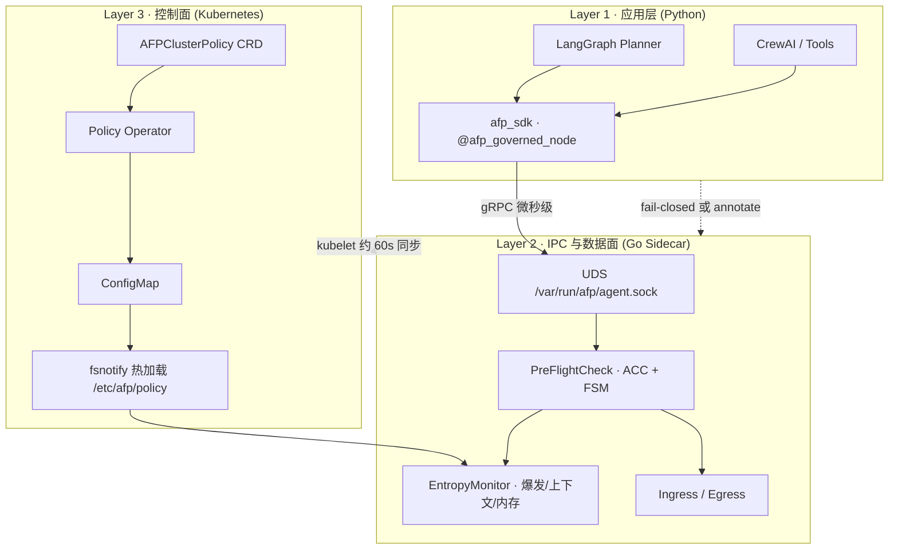

# Aegis Fabric Protocol (AFP)

**面向自主 Agent 网络的运行时协调层。**

> **"TCP governs packets. AFP governs optimizers."**
> *(TCP 治理数据包，AFP 治理优化器)*

传统互联网基础设施（TCP、Istio、API Gateway）假设节点是**被动执行者**。自主 AI Agent 是**主动优化器**——它们制定计划、递归委派、并将成本外部化。若缺乏控制论约束，必然导致**重试级联、上下文爆炸、递归委派风暴与协作坍塌。**

**Aegis Fabric Protocol（AFP）** 引入*后果持久层（CPL）*：在意图变成不可逆的网络 I/O **之前**，由带外 Sidecar 执行物理约束与自适应摩擦。

英文文档：`README.md` · **白皮书：** [AFP 技术白皮书](https://zenodo.org/records/20674352)

---

## 架构心智模型

AFP 是三层网格联邦：**应用意图层 → 本地数据面 → 声明式控制面**。



| 层级 | 职责 | 核心组件 |
|------|------|---------|
| **L1 应用层** | 在 Tool 风暴与规划死循环**之前**治理意图 | `sdk/python/afp_sdk`、`@afp_governed_node` |
| **L2 数据面** | 微秒级 Pre-Flight + Socket 级拦截 | `cmd/sidecar`、UDS IPC、ACC/FSM |
| **L3 控制面** | 声明式策略法律 + 阈值热更新 | `AFPClusterPolicy`、`cmd/operator` |

**设计法则：** *CRD 是治理的法律；IPC 是本地执行机构；Phase 2 的 gRPC 策略流是运行时指令（亚秒级 Kill Switch）。*

---

## 10 分钟快速起步

### 前置条件

- Go 1.23+、Docker、Python 3.10+（SDK 演示）
- 可选：[kind](https://kind.sigs.k8s.io/) 体验完整 K8s 路径

### 路径 A — 本地沙箱（最快）

无需 Kubernetes，验证递归断路器与意图爆发拦截：

```bash
# 终端 1 — 启动 Sidecar（SDK IPC）
AFP_IPC_SOCKET=/tmp/afp/agent.sock go run ./cmd/sidecar

# 终端 2 — 递归深度超限（期望 ISOLATED，exit 2）
AFP_IPC_SOCKET=/tmp/afp/agent.sock go run ./cmd/preflightclient \
  --recursion-depth 12

# 终端 3 — 意图爆发（期望 ISOLATED，exit 2）
AFP_IPC_SOCKET=/tmp/afp/agent.sock go run ./cmd/preflightclient \
  --estimated-tasks 10000

# 终端 4 — LangGraph 优雅降级（annotate 模式）
cd sdk/python && pip install grpcio protobuf langgraph -q
PYTHONPATH=. python examples/langgraph_planner.py
# 期望输出：annotated-stop: ... recursion depth ...
```

### 路径 B — kind 集群（完整网格）

一键脚本：构建镜像、加载到 kind、apply 清单、在 Pod 内演示：

```bash
./scripts/kind-quickstart.sh
```

手动步骤见英文 [README.md](README.md#path-b--kind-cluster-full-mesh)。

部署细节：[deploy/kubernetes/README.md](deploy/kubernetes/README.md)

---

## 企业运维与合规指南

### `AFP_SDK_FAIL_MODE` — open vs closed

| 模式 | Sidecar IPC 不可达时 | 典型场景 |
|------|---------------------|---------|
| **`open`**（开发默认） | 警告后**放行意图**，网络层可能兜底 | 本地开发、灰度、非关键沙箱 |
| **`closed`**（企业默认） | 抛出 `AFPInfrastructureError`，**停止意图生成** | 金融、医疗、生产多 Agent 网格 |

K8s 中通过 `afp-agent-config` 默认为 **`closed`**。UDS 丢失时，绝不允许 Planner 静默生成上万内部 Task。

### 调优 `entropyLimit`（物理红线）

`entropyLimit`（环境变量 `AFP_ENTROPY_LIMIT`，默认 **0.95**）是**预防性熔断**阈值。有效熵压取以下维度的 `max()`：

- 工具并发压力
- 内存 / cgroup 压力
- SDK 上报的 `context_memory_bytes`
- Planner 的 `estimated_tasks` 爆发因子

| 配置档 | `entropyLimit` | 适用场景 |
|--------|----------------|---------|
| 探索型 | 0.98 | 研发集群，容忍偶发阻尼 |
| 企业默认 | 0.95 | 安全与吞吐平衡 |
| 高保证 | 0.85–0.90 | 强隔离、严格 SLO |

集群级下发：

```yaml
apiVersion: afp.aegis-fabric.io/v1alpha1
kind: AFPClusterPolicy
metadata:
  name: enterprise-default
spec:
  targetNamespaces: [afp-system]
  entropyLimit: 0.95
  maxRecursionDepth: 10
  runMode: enterprise-mesh
  failMode: closed
```

Operator 同步 ConfigMap → `/etc/afp/policy` 文件 → Sidecar `fsnotify` 热加载（**无需重启 Pod**）。kubelet 传播约 **60 秒**；亚秒级 Kill Switch 留给 Phase 2 gRPC `StreamPolicyUpdates`。

### LangGraph 优雅降级

`on_quota_exceeded="annotate"` 将 `afp_blocked` 写入状态，由图路由处理人工介入，而非崩溃整条流水线：

```python
@afp_governed_node(on_quota_exceeded="annotate", estimated_tasks=10)
def planner_node(state):
    ...
```

---

## 实证铁证 — Monte Carlo

**1,000 次聚合 × 500 节点 × 5% 恶意 × 100 Epoch**

| 网络 | 结果 |
|------|------|
| **Baseline** | 存活 **500 → 2.05**（约 0.4%）— 协同坍塌 |
| **AFP** | **500.00** 存活（**100%** 拓扑存活率） |

```bash
go run ./cmd/simulator
make demo-report
```

---

## Python SDK

```bash
cd sdk/python && ./scripts/gen_proto.sh
make sdk-test
```

详见 [sdk/python/README.md](sdk/python/README.md)

---

## Kubernetes 部署

| 资源 | 路径 |
|------|------|
| Pod 模板（通用） | `deploy/kubernetes/agent-pod-template.yaml` |
| **Demo 部署** | `deploy/kubernetes/agent-pod-demo.yaml` |
| CRD | `deploy/kubernetes/crd/afpclusterpolicy.yaml` |
| Operator | `deploy/kubernetes/operator-deployment.yaml` |

```bash
make build
./scripts/kind-quickstart.sh
```

---

## Demo Agent 镜像

预打包 LangGraph Planner，K8s 内无需本地 Python 即可体验应用层治理。

```bash
make demo-agent-docker
# 或完整 kind 路径（同时构建 sidecar + demo agent）：
make kind-quickstart
```

| 镜像 | 用途 |
|------|------|
| `ghcr.io/filthymudblood/aegis-fabric-sidecar:latest` | L2 数据面 + `preflightclient` |
| `ghcr.io/filthymudblood/afp-demo-agent:latest` | L1 LangGraph `@afp_governed_node` 循环演示 |

由 `Dockerfile.demo-agent` 构建；用 `deploy/kubernetes/agent-pod-demo.yaml` 部署。

查看应用层拦截日志：

```bash
kubectl -n afp-system logs -f deploy/afp-agent-node -c agent-core
# 期望：annotated-stop: ... recursion depth exceeded ...
```

本地单次运行（需 sidecar）：

```bash
cd sdk/python && PYTHONPATH=. python examples/langgraph_planner.py
cd sdk/python && PYTHONPATH=. python examples/langgraph_planner.py --loop --interval 10
```

---

## 项目结构

```text
aegis-fabric/
├─ api/afp/v1/           # protobuf 契约
├─ cmd/sidecar, operator, preflightclient
├─ internal/controller/    # K8s Operator
├─ sdk/python/afp_sdk/   # Python SDK + LangGraph 适配器
├─ deploy/kubernetes/    # 生产 IaC
├─ Dockerfile.demo-agent # LangGraph 演示 Agent 镜像
├─ scripts/              # 验证脚本 + kind-quickstart.sh
```

---

## 运行模式

| `AFP_RUN_MODE` | 行为 |
|----------------|------|
| `enterprise-mesh` | AFP-Core：拥塞、递归、熵压（默认） |
| `open-exchange` | Core + 零信任陌生人税 |

---

## 可观测性

- 指标：`http://<pod>:9090/metrics`
- 关键序列：`afp_preflight_actions_total`、`afp_ingress_actions_total`

---

## 实现状态

**已交付：** 数据面 · SDK IPC · LangGraph 适配器 · K8s Sidecar 伴生部署 · CRD Operator · ConfigMap 热加载

**硬化中：** cgroup 完整读取 · 生产级签名校验 · iptables/eBPF · gRPC 策略推流（Phase 2）

---

## 许可证

Apache License 2.0 — 详见 [LICENSE](LICENSE)。
